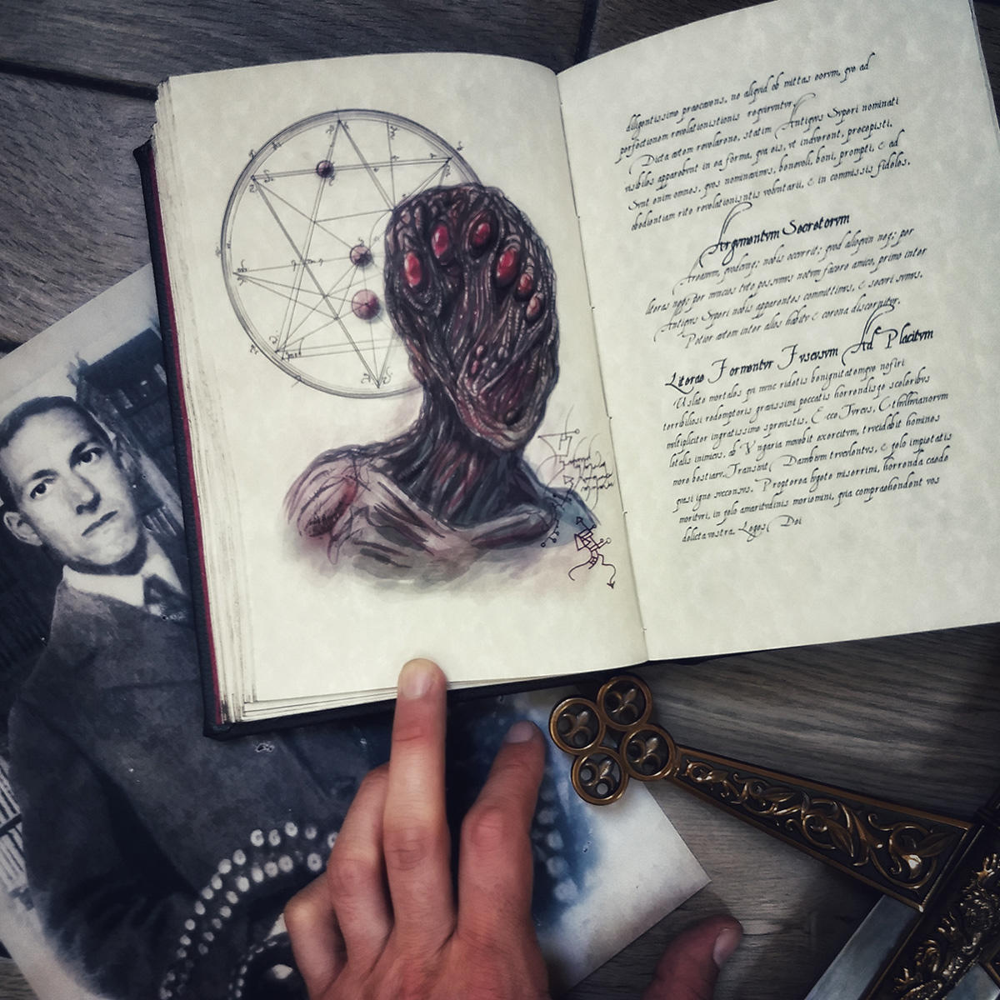

[](https://classroom.github.com/online_ide?assignment_repo_id=6908356&assignment_repo_type=AssignmentRepo)


# The Call of Cthulhu - Interactive Horror Game

>CIT 128 Student Directed Project


## Student Info

>Add your Name, CRN, and Semester Year here using unordered bullets in Markdown.

* Erika Iwata
* CRN: 37902
* Spring 2022


## Program Description

>Describe your individual project program and include the goals of the program.

<p >
    
</p>


_The Call of Cthulhu - Interactive Horror Game_ is a choose your own adventure game based on the book by H.P. Lovecraft. This is a text-based game and allows the user to make decisions which leads them down different forks toward alternate endings of the story.

Source: _The Call of Cthulhu and Other Weird Stories_
<br> ISBN: 978-0-14-118234-6


__Some Context:__

About the Author:

Howard Phillips Lovecraft was an early 20th century horror writer. At the time, his works were published in _Weird Tales_ magazines and did not receive the amount of recognition that they do today. Because of this, he lived much of his life in poverty and this was actually one of the main causes for his depression. Nowadays, he is accredited as being the father of cosmic horror a.k.a. lovecraftian horror and known to have been one of the most influencial figures in the literary community for the horror genre.

Cosmic horror can be described as fear of the unknown or the unimaginable. Often times, the root of fear in cosmic horror is of such a grand/cosmic scale that the mere revelation of their existence is enough to drive people into insanity. Furthermore, many of the creatures in the Cthulhu Mythos are not known to be evil. They just exist as their own separate entities apart from mankind. Lovecraft's philosophy was a weird mix of anthropocentrism and nihilism and his works involved reflecting upon the vastness of the universe and realising the insignificance of humanity in comparison.

Pop Culture Examples of Lovecraftian Themes:
 * The Thing (1982)
 * Bird Box (2018)
 * Junji Ito's works

__Some of the goals of this project are:__

Core Features:
- [X] Dialogue displays on the screen gradually as user iterates through the game
- [X] Smooth transition between scenes
- [ ] Game Over screen allows user to select between Play Again or Quit

Bonus Features:
- [X] Click to skip scene
- [X] Resizable GUI window
- [ ] Decision timer (10 sec) or else it autoselects decision A over decision B
- [ ] If user selects Play Again it displays scenes traversed during the previous iteration of the game and allows the user to select a story point to revive from

### Video Demonstration

>Add a Link to your video demonstration

### Install Instructions

>Add any install instructions, if needed. This includes how to install included modules or libraries as well as configurations. You may remove this section if no special instructions are required.

- Python3
    - How to install: `brew install python3`
- Pygame
    - How to install: `pip install pygame`

## Software Engineering

>Describe the software engineering techniques used for the design and development of this program.

This game was made using `pygame.py` and organized into the following files:
```
main.py
initgame.py
gamefeatures.py
scenes.py
dialogue.txt
```
From `main.py`, the `main()` function first created an object of the class `Game_Features()` from `gamefeatures.py`. Then it just called the `scene_manager()` method, which had the story indexed into a binary tree, and used it to traverse between different nodes of the story.
```
Game_Features()
    .
    .
    scene_manager()
        .
        .
                                              1
                                             /
                                            2
                                           /
                                          3
                                         /
                                        4
                                       /
                                      5
                                     / \
                                    6   7
                                   /
                                  8
                                 / \
                                9   10
                               /     \
                              11      12
                             /
                            13
                           /
                          14
                         /
                        15
                       /
                      16
                     /
                    17
                   /
                  18
                 /  \
                19   20
               /
              21
             /
            22
           /  \
          23   24
        .
        .
```
_See also:_ [Cthulhu Decision Tree pdf](https://drive.google.com/file/d/1y-Ar-hCq-sWJkWkNjTRm8chB-Nbs8YqH/view?usp=sharing)

## Directions and Grading Rubric

>To review the project directions or update the grading rubric review the [DIRECTIONS.md](DIRECTIONS.md) file.
